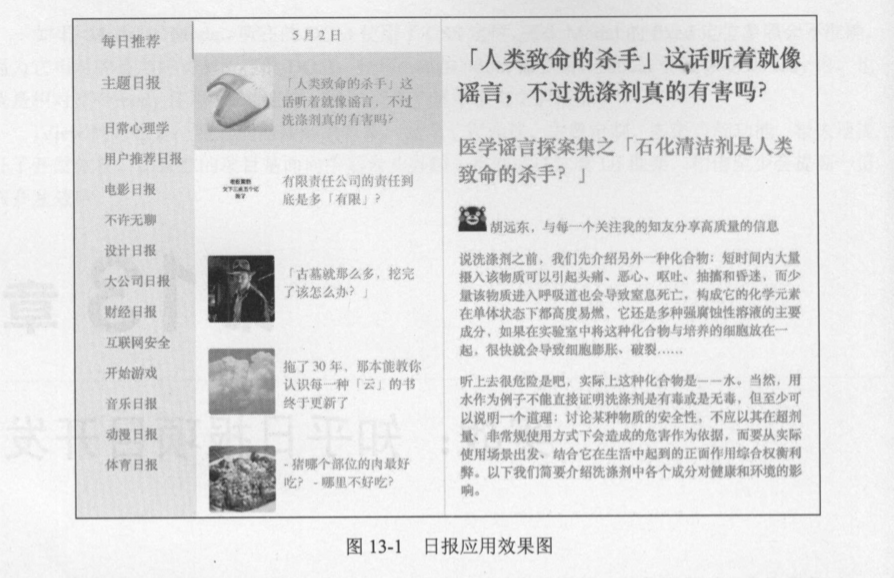

# 13.1 分析与准备

本章将以第 10 章的 webpack 配置为基础进行开发，可以先到 GitHub 下载工程配置文件:https://github.com/icarusion/vue-book/tree/master/demo ，将项目保存到新建的 daily 目录，然后完成依赖安装。本章所有的代码也上传至 GitHub ，访问链接可以查看并直接使用:

[https://github.com/icarusion/vue-book/tree/master/daily](https://github.com/icarusion/vue-book/tree/master/daily)

日报是一个单页的应用，由 3 部分组成，如图 13-1 所示。

左侧是菜单，分为“每日推荐”和“主题日报”两个类型，中间是文章列表，右侧是文章正 文和评论。其中每日推荐按日期排列，比如图中显示为 5 月 2 日的推荐文章，中间栏滚动至底部时，自动加载前 一 天的推荐内容。

主题日报有“日常心理学”等 10 多个子分类，分类列表默认是收起的，点击“主题日报”菜单时切换展开和收起的状态。点击某个子分类后，中间栏切换为该类目下的文章列表，不再按时间 排列。点击文章列表中的某一项，在右侧渲染对应文章的内容和评论。

知乎日报的接口地址前缀为[http://news-at.zhihu.com/api/4/](http://news-at.zhihu.com/api/4/)，图片地址前缀为[https://picl.zhimg.com](https://picl.zhimg.com)，由于两者都开启了跨域限制，无法在前端直接调用，因此要开发一个代理。



> 跨域限制是服务端的一个行为，当开启对某些域名的访问限制后，只有同域或指定域 下的页面可以调用，这样相对来说更安全，图片也可以防盗链 。 跨域限制一般只在浏 览器端存在，对于服务端或 iOS、 Android 等客户端是不存在的。使用代理是开发过程 中常见的一种解决方案 。

我们使用基于 Node.js 的 request库来做代理，通过 NPM 安装 request:

```bash
npm install request --save-dev
```

在 daily 目录下新建一个 proxy.js 的文件，写入以下内容(如果你不太了解 Node.js，可以直接使用〉:

```javascript
const http = require('http');
const request = require('request');

const hostname = '127.0.0.1';
const port = 8010;
const imgPort = 8011;

// 创建一个 API 代理服务
const apiServer = http.createServer((req, res) => {
    const url = 'http://news-at.zhihu.com/api/4' + req.url;
    const options = {
        url: url
    };

    function callback (error, response, body) {
        if (!error && response.statusCode === 200) {
            // 设置编码类型，否则中文会显示为乱码
            res.setHeader('Content-Type', 'text/plain;charset=UTF-8');
            // 设置所有域允许跨域
            res.setHeader('Access-Control-Allow-Origin', '*');
            // 返回代理后的内容
            res.end(body);
        }
    }
    request.get(options, callback);
});
// 监听 8010 端口
apiServer.listen(port, hostname, () => {
    console.log(`接口代理运行在 http://${hostname}:${port}/`);
});
// 创建一个图片代理服务
const imgServer = http.createServer((req, res) => {
    const url = req.url.split('/img/')[1];
    const options = {
        url: url,
        encoding: null
    };

    function callback (error, response, body) {
        if (!error && response.statusCode === 200) {
            const contentType = response.headers['content-type'];
            res.setHeader('Content-Type', contentType);
            res.setHeader('Access-Control-Allow-Origin', '*');
            res.end(body);
        }
    }
    request.get(options, callback);
});
// 监听 8011 端口
imgServer.listen(imgPort, hostname, () => {
    console.log(`图片代理运行在 http://${hostname}:${imgPort}/`);
});
```

监昕了两个端口: 8010 和 801l。 8010 用于接口代理， 801l 用 于图片代理。 比如请求的真实 接口为 [http://news-at.zhihu.com/api/4/news/3892357](http://news-at.zhihu.com/api/4/news/3892357) ， 开发时改写为 [http://127.0.0.1:8010/news/3892357](http://127.0.0.1:8010/news/3892357): 图片的其实也址为 [https:/pic4.zhimg.com/v2-b44636ccd2affac97ccc0759a0f46f7f.jpg](https:/pic4.zhimg.com/v2-b44636ccd2affac97ccc0759a0f46f7f.jpg)， 开发时改写为 [http://127.0.0.1:8011/img/https://pic4.zhimg.com/v2-b44636ccd2affac97ccc0759a0f46f7f.jpg](http://127.0.0.1:8011/img/https://pic4.zhimg.com/v2-b44636ccd2affac97ccc0759a0f46f7f.jpg)。

代理的核心是在返回的头部(response header)中添加一项 Access-Control-Allow-Origin 为“*”，也就是允许所有的域访问。

最后在终端使用 Node 启动代理服务:

node proxy.js

如果成功，就会在终端显示两行日志:

接口代理运行在 [http://127.0.0.1:8010/](http://127.0.0.1:8010/)

图片代理运行在 [http://127.0.0.1:8011/](http://127.0.0.1:8011/)

对于接口的 Ajax 请求，前端有很多实现方案，比如 jQuery 的$.ajax，但是只为使用 Ajax 而引 入一个 jQuery 显然不太友好。如果你完成了 11.3 章节的练习题，可以用做好的 Vue 插件通过 this.$ajax 直接请求。 Vue 官方也提供了 vue-resource 插件，但是不再维护，而是推荐使用 axios, 所以本章示例也基于 axios 来做异步请求。

axios 是基于 Promise 的 HTTP 库，同时支持前端和 Node.js。首先用 NPM 安装 axios:

```bash
npm install axios --save
```

在 daily 目录下新建目录 libs，井在 libs 下新建 util.js 文件，项目中使用的工具函数可以在这里封装。比如对 axios封装，写入请求地址的前缀，在业务中只用写相对路径，这样可以灵活控制。 另外，可以全局拦截 axios 返回的内容，简单处理，只需返回我们需要的数据。其代码如下:

```javascript
// util.js
import axios from 'axios';

const Util = {
    imgPath: 'http://127.0.0.1:8011/img/',
    apiPath: 'http://127.0.0.1:8010/'
};

// 获取今天时间戳
Util.getTodayTime = function () {
    const date = new Date();
    date.setHours(0);
    date.setMinutes(0);
    date.setSeconds(0);
    date.setMilliseconds(0);
    return date.getTime();
};

// 获取上一天日期
Util.prevDay = function (timestamp = (new Date()).getTime()) {
    const date = new Date(timestamp);
    const year = date.getFullYear();
    const month = date.getMonth() + 1 < 10
        ? '0' + (date.getMonth() + 1)
        : date.getMonth() + 1;
    const day = date.getDate() < 10
        ? '0' + date.getDate()
        : date.getDate();
    return year + '' + month + '' + day;
};

// Ajax 通用配置
Util.ajax = axios.create({
    baseURL: Util.apiPath
});

// 添加响应拦截器
Util.ajax.interceptors.response.use(res => {
    return res.data;
});

export default Util;
```

更多关于 axios 的使用可以查阅官方文档: [https://github.com/mzabriskie/axios](https://github.com/mzabriskie/axios)。

做好这些准备后，就可以开始日报应用的开发了。
