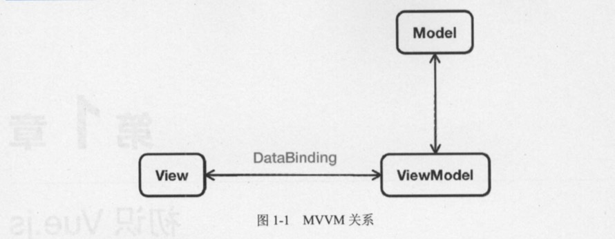

# 1.1 Vue.js 是什么

Vue.js的官方文档中是这样介绍它的。简单小巧的核心，渐进式技术栈，足以应付任何规模的应用。

简单小巧是指Vue.js压缩后大小仅有17KB。所谓渐进式(Progressive)，就是你可以一步一步、有阶段性地来使用 Vue.js，不必一开始就使用所有的东西。随着本书的不断介绍，你会深刻感受到这一点，这也正是开发者热爱Vue.js的主要原因之一。

使用Vue.js可以让Web开发变得简单，同时也颠覆了传统前端开发模式。它提供了现代Web开发中常见的高级功能，比如:

- 解辑视图与数据。
- 可复用的组件。
- 前端路由。
- 状态管理。
- 虚拟DOM(Virtual DOM)。

## 1.1.1 MVVM模式

与知名前端框架Angular、Ember等一样，Vue.js在设计上也使用MVVM(Model-View-View Model)模式。

MVVM模式是由经典的软件架构MVC衍生来的。当View(视图层)变化时，会自动更新到ViewModel(视图模型)，反之亦然。View和ViewModel之间通过双向绑定(data-binding)建立联系，如图1-1所示。



# 1.1.2 Vue.js有什么不同

如果你使用过jQuery，那你一定对操作DOM、绑定事件等这些原生JavaScript能力非常熟悉，比如我们在指定DOM中插入一个元素，并给它绑定一个点击事件:

```js
if(showBtn){
    var btn = $('<button>Click me</button>');
    btn.on('click', function () {
        console.log('Clicked!');
    });
    $('#app').append(btn);
}
```

这段代码不难理解，操作的内容也不复杂，不过这样让我们的视图代码和业务逻辑紧藕合在一起，随着功能不断增加，直接操作DOM会使得代码越来越难以维护。

而Vue.js通过MVVM的模式拆分为视图与数据两部分，并将其分离。因此，你只需要关心你的数据即可，DOM的事情Vue会帮你自动搞定，比如上面的示例用Vue.js可以改写为:

```typescript jsx
<body>
    <div id="app">
        <button v-if="showBtn" v-on:click="handleClick">Click me</button>
    </div>
</body>
<script>
    new Vue({
        el: '#app',
        data: {
            showBtn: true
        },
        methods: {
            handleClick: function () {
                console.log('Clicked !');
            }
        }
    })
</script>
```

> 暂时还不需要理解上述代码，这里只是快速展示Vue.js的写法，在后面的章节会详细介绍每个参数的用法。