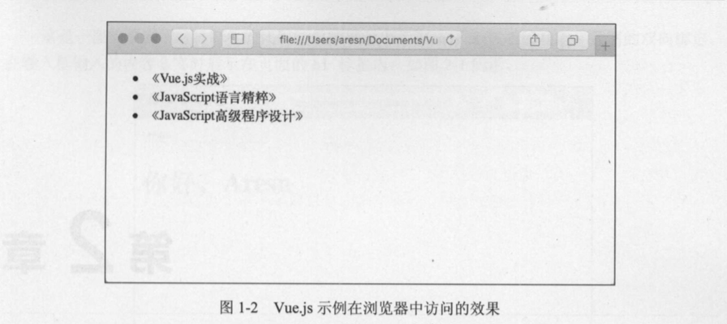

# 1.2 如何使用Vue.js

每一个框架的产生都是为了解决某个具体的问题。在正式开始学习Vue.js前，我们先对传统前端开发模式和Vue.js的开发模式做一个对比，以此了解Vue.js产生的背景和核心思想。

## 1.2.1 传统的前端开发模式

前端技术在近几年的发展迅速，如今的前端开发已不再是10年前的写个HTML何CSS那样简单了，新的概念层出不穷，比如ECMAScript 6、Node.js、NPM、前端工程化等。这些新东西在不断的优化我们的开发模式，改变我们的编程思想。

随着这些技术的普及，一套可称为"万金油"的技术栈被许多商业项目用于生产环境：

jQuery + RequireJS (SeaJS) + artTemplate (doT) + Gulp (Grunt)

这套技术战以jQuery为核心，能兼容绝大部分浏览器，这是很多企业比较关心的，因为他们的客户很可能还在用IE7及以下浏览器。使用RequireJS或SeaJS进行模块化开发可以解决代码依赖混乱的问题，同时便于维护及团队协作。使用轻量级的前端模板(如doT)可以将数据与HTML模板分离。最后，使用自动化构建工具(如 Gulp)可以合并压缩代码，如果你喜欢写Less、Sass以及现在流行的ES 6，也可以帮你进行预编译。

这样一套看似完美无瑕的前端解决方案就构成了我们所说的传统前端开发模式，由于它的简单、高效、实用，至今仍有不少开发者在使用。不过随着项目的扩大和时间的推移，出现了更复杂的业务场景，比如SPA(单页面富应用〉、组件解稍等。为了提升开发效率，降低维护成本，传统的前端开发模式己不能完全满足我们的需求，这时就出现了如Angular、React以及我们要介绍的主角Vue.js。

## 1.2.2 Vue.js的开发模式

Vue.js是一个渐进式的JavaScript框架，根据项目需求，你可以选择从不同的维度来使用它。如果你只是想体验Vue.js带来的快感，或者开发几个简单的HTML 5页面或小应用，你可以直接通过script加载CDN文件，例如:

```html
<!-- 自动识别最新稳定版本的Vue.js -->
<script src="https://unpkg.com/vue/dist/vue.min.js"></script>
<!-- 指定某个具体版本的Vue.js -->
<script src="https://unpkg.com/vue@2.1.6/dist/vue.min.js"></script>
```

两种版本都可以，如果你不太了解各版本的差别，建议直接使用最新的稳定版本。当然，你也可以将代码下载下来，通过自己的相对路径来引用。引入Vue.js框架后，在body底部使用new Vue()的方式创建一个实例，这就是Vue.js最基本的开发模式。现在可以写入以下完整的代码来快速体验Vue:

```html

```

```html
<!DOCTYPE html>
<html>
<head>
    <meta charset="utf-8">
    <title>Vue 示例</title>
</head>
<body>
<div id="app">
    <ul>
        <li v-for="book in books">{{ book.name }}</li>
    </ul>
</div>
<script src="https://unpkg.com/vue/dist/vue.min.js"></script>
<script>
    new Vue({
        el: '#app',
        data: {
            books: [
                {name: '《Vue.js实战》'},
                {name: '《JavaScript 语言精粹》'},
                {name: '《JavaScript 高级程序设计》'}
            ]
        }
    })
</script>
</body>
</html>
```

在浏览器中访问它，会将图书列表循环显示出来，如图1-2所示。



对于一些业务逻辑复杂，对前端工程有要求的项目，可以使用Vue单文件的形式配合webpack使用，必要时还会用到vuex来管理状态，vue-router来管理路由。这里提到了很多概念，目前还不必去过多了解，只是说明Vue.js框架的开发模式多样化，后续章节会详细介绍，到时就会对整个Vue生态有所了解了。

了解了Vue.js的开发模式后，相信你已经迫不及待地想开启Vue的大门了。直接进入话题，创建第一个Vue应用。