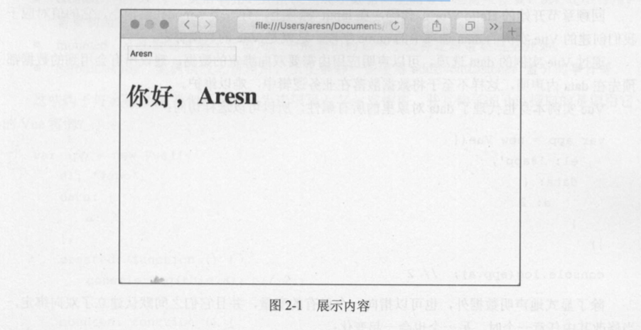

# 第二章 数据绑定和第一个Vue应用

学习任何一种框架，从一个Hello World应用开始是最快了解该框架特性的途径，我们先从一段简单的HTML代码开始，感受Vue.js最核心的功能。

```html
<!DOCTYPE html>
<html>
<head>
    <meta charset="utf-8">
    <title>Vue 示例</title>
</head>
<body>
    <div id="app">
        <input type="text" v-model="name" placeholder="你的名字">
        <hl>你好，{{ name }}</hl>
    </div>
    <script src="https://unpkg.com/vue/dist/vue.min.js"></script>
    <script>
        var app = new Vue({
            el: '#app',
            data: {
                name: ''
            }
        })
    </script>
</body>
</html>
```

这是一段简单到不能再简单的代码，但却展示出了Vue.js最核心的功能：数据的双向绑定。在输入框输入的内容会实时展示在页丽的hl标签内，如图2-1所示。



> 从本章开始，示例不再提供完整的代码，而是根据上下文，将HTML部分与JavaScript部分单独展示，省咯了head、body等标签以及Vue.js的加载等，读者可根据上例结构来组织代码。

