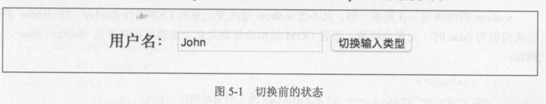
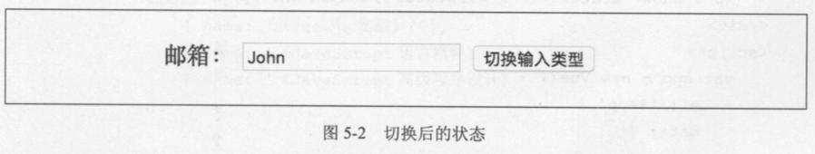

# 5.2 条件渲染指令

## 5.2.1 v-if、 v-else-if、 v-else

与 JavaScript 的条件语句 if else、 else if类似， Vue.js 的条件指令可以根据表达式的值在 DOM 中渲染或销毁元素/组件，例如:

```html
<div id="app">
    <p v-if="status === 1">当 status 为 1 时显示该行</p>
    <p v-else-if="status === 2">当status为2时显示该行</p>
    <p v-else>否则显示该行</p>
</div>
<script>

    var app = new Vue({
        el: '#app',
        data: {
            status: 1
        }
    })

</script>
```

v-else-if 要紧跟 v-if, v-else 要紧跟 v-else-if或 v-if，表达式的值为 真时 ， 当前元素/组件及所 有子节点将被渲染，为假时被移除。如果一次判断的是多个元素，可以在 Vue.js内置的\<template>元素上使用条件指令，最终渲染的结果不会包含该元素，例如:

```html
<div id="app">
    <template v-if="status === 1">
        <p>这是一段文本</p>
        <p>这是一段文本</p>
        <p>这是一段文本</p>
    </template>
</div>
<script>

    var app = new Vue({
        el: '#app',
        data: {
            status: 1
        }
    })

</script>
```

Vue 在渲染元素时 ，出于效率考虑，会尽可能地复用已有的元素而非重新渲染，比如下面的示例：

```html
<div id="app">
    <template v-if="type ==='name'">
        <label>用户名 :</label>
        <input placeholder="输入用户名"></template>
    <template v-else>
        <label>邮箱 : </label>
        <input placeholder="输入邮箱">
    </template>
    <button @click="handleToggleClick">切换输入类型</button>
</div>
<script>

    var app = new Vue({
        el: '#app',
        data: {
            type: 'name'
        },
        methods: {
            handleToggleClick: function () {
                this.type = this.type === 'name' ? 'mail' : 'name';
            }
        }

    })

</script>
```

如图 5-1 和图 5-2所示，键入内容后，点击切换按钮，虽然 DOM变了，但是之前在输入框键 入的内容并没有改变，只是替换了 placeholder 的内容，说明<input>元素被复用了。





如果你不希望这样做，可以使用 Vue.js 提供的 key 属性，它可以让你自己决定是否要复用元素， key的值必须是唯一的，例如:

```html
<div id="app">
    <template v-if="type ==='name'">
        <label>用户名 :</label>
        <input placeholder="输入用户名" key="name-input">
    </template>
    <template v-else>
        <label>邮箱 : </label>
        <input placeholder="输入邮箱" key="mail-input">
    </template>
    <button @click="handleToggleClick">切换输入类型</button>
</div>
<script>

    var app = new Vue({
        el: '#app',
        data: {
            type: 'name'
        },
        methods: {
            handleToggleClick: function () {
                this.type = this.type === 'name' ? 'mail' : 'name';
            }
        }

    })

</script>
```

给两个<input>元素都增加 key 后 ， 就不会复用了，切换类型时键入的内容也会被删除，不过 <label>元素仍然是被复用的，因为没有添加 key属性。

## 5.2.2 v-show

v-show的用法与v-if基本一致，只不过v-show是改变元素的css属性display。当v-show 表达式的值为 false 时， 元素会隐藏，查看 DOM 结构会看到元素上加载了内联样式 display: none;, 例如 :

```html
<div id="app">
    <p v-show="status === 1">当status为1时显示该行</p>
</div>
<script>

    var app = new Vue({
        el: '#app',
        data: {
            status: 2
        }
    })

</script>
```

渲染后的结果为 :

```html
<p style="display: none;">当status为1时显示该行</p>
```

> v-show不能在\<template>上使用

## 5.2.3 v-if与 v-show 的选择

v-if和 v-show 具有类似的功能，不过 v-if才是真正的条件渲染，它会根据表达式适当地销毁 或重建元素及绑定的事件或子组件。若表达式初始值为 false，则一开始元素/组件并不会渲染，只 有当条件第 一 次变为真时才开始编译。

而 v-show 只是简单的 css 属性切换，无论条件真与否，都会被编译。相比之下， v-if更适合条件不经常改变的场景，因为它切换开销相对较大，而 v-show 适用于频繁切换条件。
