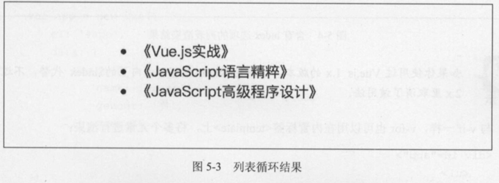
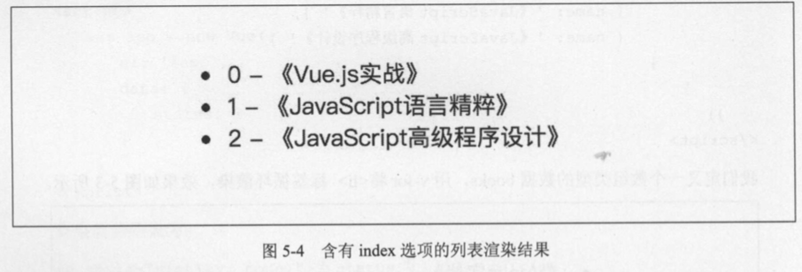
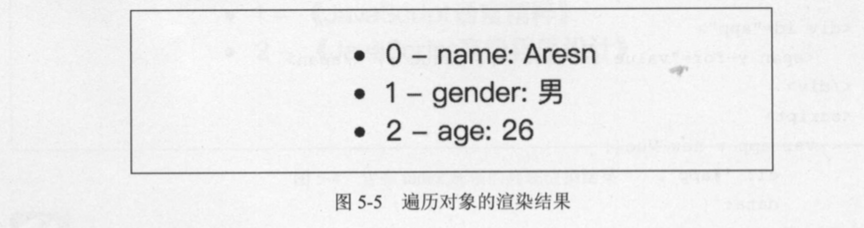

# 5.3 列表渲染指令 v-for

## 5.3.1 基本用法

当需要将一个数组遍历或枚举一个对象循环显示时，就会用到列表渲染指令 v-for。它的表达式需结合 in来使用，类似 item in items 的形式，看下面的示例 :

```html
<div id="app">
    <ul>
        <li v-for="book in books">{{ book.name }}</li>
    </ul>
</div>
<script>

    var app = new Vue({
        el: '#app',
        data: {
            books: [
                {name: '《Vue.js实战》'},
                {name: '《JavaScript语言精粹》'},
                {name: '《JavaScript高级程序设计》'}
            ]
        }
    })

</script>
```

我们定义一个数组类型的数据books， 用v-for将<li>标签循环渲染， 效果如图5-3所示。



在表达式中， books 是数据， book 是当前数组元素的别名 ， 循环出的每个<li>内的元素都可以访问到对应的当前数据 book。列表渲染也支持用 of来代替 in 作为分隔符 ，它更接近 JavaScript迭代器的语法 :

```html
<li v-for="book of books">{{ book.name }}</li>
```

v-for 的表达式支持一个可选参数作为当前项的索引 ，例如 :

```html
<div id="app">
    <ul>
        <li v-for="(book, index) in books">{{ index }} - {{ book.name }}</li>
    </ul>
</div>
<script>

    var app = new Vue({
        el: '#app',
        data: {
            books: [
                {name: '《Vue.js实战》'},
                {name: '《JavaScript语言精粹》'},
                {name: '《JavaScript高级程序设计》'}
            ]
        }
    })

</script>
```

分隔符 in 前的语句使用括号 ， 第二项就是 books 当前项的索引，渲染后的结果如图 5-4 所示。



> 如果你使用过 Vue.js l.x 的版本，这里的 index 也可以由内置的 $index 代替， 不过在2.x里取消 了该用法.

与 v-if一样， v-for也可 以用在 内置标签<template>上， 将多个元素进行渲染 :

```html
<body>
<div id="app">
    <template v-for="book in books">
        <li>书名:{{ book.name }}</li>
        <li>作者:{{ book.author }}</li>
    </template>
</div>
<script>

    var app = new Vue({
        el: '#app',
        data: {
            books: [
                {
                    name: '《Vue.js实战》',
                    author: '梁灏'
                },
                {
                    name: '《JavaScript语言精粹》',
                    author: 'Douglas Crockford'
                },
                {
                    name: '《JavaScript高级程序设计》',
                    author: 'Nicholas C.Zakas'
                }
            ]
        }
    })

</script>
```

除了数组外 ，对象的属性也是可以遍历的，例如 :

```html
<div id="app">
    <span v-for=" value in user">{{ value }} </span>
</div>
<script>

    var app = new Vue({
        el: '#app',
        data: {
            user: {
                name: 'Aresn',
                gender: '男',
                age: 26
            }

        }
    })

</script>
```

渲染后的结果为 :

```html
<span>Aresn </span><span>男</span><span>26 </span>
```

遍历对象属性时，有两个可选参数，分别是键名和索引:

```html
<div id="app">
    <ul>
        <li v-for="(value, key, index) in user">
            {{ index }} - {{ key }}: {{ value }}
        </li>
    </ul>
</div>
<script>

    var app = new Vue({
        el: '#app',
        data: {
            user: {
                name: 'Aresn',
                gender: '男',
                age: 26
            }

        }
    })

</script>
```

渲染后的结果如图 5-5 所示。



v-for还可以迭代整数 : 

```html
<div id="app">
    <span v-for="n in 10">{{ n }} </span>
</div>
<script>

    var app = new Vue({
        el: '#app'
    })

</script>
```

渲染后的结果为:

1 2 3 4 5 6 7 8 9 10

## 5.3.2 数组更新

Vue 的核心是数据与视图的双向绑定，当我们修改数组时， Vue 会检测到数据变化，所以用v-for 渲染的视图也会立即更新。 Vue 包含了 一组观察数组变异的方法，使用它们改变数组也会触发视图更新:

- push()
- pop()
- shift()
- unshift()
- splice()
- sort()
- reverse()

例如，我们将之前一个示例的数据 books 添加一项 :

```typescript
app.books.push({
    name: '《CSS 揭秘》',
    author: '[希] Lea Verou'
});
```

可以尝试编写完整示例来查看效果。

使用以上方法会改变被这些方法调用的原始数组，有些方法不会改变原数组，例如:

- filter()
- concat()
- slice()

它们返回的是一个新数组，在使用这些非变异方法时，可以用新数组来替换原数组，还是之前展示书目的示例，我们找出含有 JavaScript关键词的书目，例如 :

```html
<div id="app">
    <template v-for="book in books">
        <li>书名:{{ book.name }}</li>
        <li>作者:{{ book.author }}</li>
    </template>
</div>
<script>

    var app = new Vue({
        el: '#app',
        data: {
            books: [
                {
                    name: '《Vue.js实战》',
                    author: '梁灏'
                },
                {
                    name: '《JavaScript语言精粹》',
                    author: 'Douglas Crockford'
                },
                {
                    name: '《JavaScript高级程序设计》',
                    author: 'Nicholas C.Zakas'
                }
            ]
        }
    })

    app.books = app.books.filter(function (item) {
        return item.name.match(/JavaScript/);
    });

</script>
```

渲染的结果中，第一项《 Vue.js 实战》被过滤掉了，只显示了书名中含有 JavaScript 的选项。

Vue在检测到数组变化时，并不是直接重新渲染整个列表，而是最大化地复用 DOM元素。替 换的数组中，含有相同元素的项不会被重新渲染，因此可以大胆地用新数组来替换旧数组，不用担 心性能问题 。

需要注意 的是，以下变动的数组中， Vue 是不能检测到的，也不会触发视图更新:

- 通过索引直接设置项，比如 app.books[3] = { ... }。
- 修改数组长度，比如 app.books.length= 1。

解决第 一个问题可以用两种方法实现同样的效果，第 一种是使用 Vue 内置的 set 方法:

```javascript
Vue.set(app.books, 3, {
    name: '《css揭秘》',
    author:'[希] Lea Verou'
});
```

如果是在 webpack 中使用组件化的方式(进阶篇中将介绍〉，默认是没有导入 Vue 的，这时可以使用 $set ，例如:

```javascript
this.$set(app.books, 3, {
    name: '《css揭秘》',
    author:'[希] Lea Verou'
});
```

> 这里的 this 指向的就是当前组件实例，即 app。在非 webpack 模式下也可以用 $set 方法，例如 app.$set(...)

另一种方法:

```javascript
app.books.splice(3, 1, {
    name: '《css揭秘》',
    author:'[希] Lea Verou'
})
```

第二个问题也可以直接使用splice来解决：

```javascript
app.books.splice(1)
```

5.3.3 过滤与排序

当你不想改变原数组，想通过一个数组的副本来做过滤或排序的显示时，可以使用计算属性来返回过滤或排序后的数组，例如 :

```html
<div id="app">
    <template v-for="book in filterBooks">
        <li>书名:{{ book.name }}</li>
        <li>作者:{{ book.author }}</li>
    </template>
</div>
<script>

    var app = new Vue({
        el: '#app',
        data: {
            books: [
                {
                    name: '《Vue.js实战》',
                    author: '梁灏'
                },
                {
                    name: '《JavaScript语言精粹》',
                    author: 'Douglas Crockford'
                },
                {
                    name: '《JavaScript高级程序设计》',
                    author: 'Nicholas C.Zakas'
                }
            ]
        },
        computed: {
            filterBooks: function () {
                return this.books.filter(function (book) {
                    return book.name.match(/JavaScript/);
                })
            }
        }
    })

</script>
```

上例是把书名中包含 JavaScript 关键词的数据过滤出来，计算属性 filterBooks 依赖 books，但是不会修改 books。实现排序也是类似的，比如在此基础上新加一个计算属性 sortedBooks，按照书 名的长度由长到短进行排序:

```html
computed: {
    sortedBooks: function () {
        return this.books.sort(function (a, b) {
            return a.name.length < b.name.length;
        }
    }
}
```

> 在 Vue.js 2.x 中废弃了 l.x 中内置的 limitBy、 filterBy 和 orderBy 过滤器，统一改用计算属性来实现。