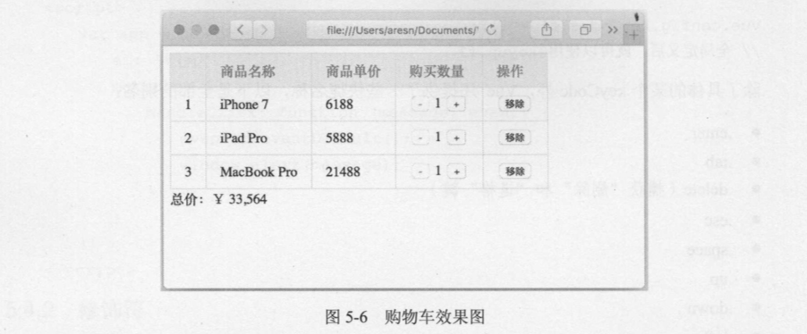

# 5.5 实战:利用计算属性、指令等知识开发购物车

前 5 章 内容基本涵盖了 Vue.js 最核心和常用的知识点，掌握这些内容己经可以上手开发一些 小功能了。本节则以 Vue.js 的计算属性、内置指令、方法等内容为基础，完成一个在业务中具有 代表性的小功能:购物车 。

在开始写代码前，要对需求进行分析，这样有助于我们理清业务逻辑，尽可能还原设计与产品交互 。

购物车需要展示 一个己加入购物车的商品列表，包含商品名称、商品单价、购买数量和操作等信息，还需要实时显示购买的总价。其中购买数量可以增加或减少，每类商品还可以从购物车中移除。最终实现的效果如图 5-6所示。



在明确需求后，我们就可以开始编程了，因为业务代码较多，这次我们将 HTML、 CSS、JavaScript分离为 3个文件，便于阅读和维护:

- index.html (引入资源及模板)
- index.js (Vue实例及业务代码)
- style.css (样式)

先在index.html中引入Vue.js 和相关资源，创建一个根元素来挂载 Vue实例:

```html
<!DOCTYPE html>
<html lang="en">
<head>
    <meta charset="UTF-8">
    <title>购物车示例</title>
    <link rel="stylesheet" type="text/css" href="style.css">
</head>
<body>
    <div id="app" v-cloak>
    </div>
    <script src="https://unpkg.com/vue/dist/vue.min.js"></script>
    <script src="index.js"></script>
</body>
</html>
```

注意，这里将 vue.min.js 和 index.js文件写在<body>的最底部，如果写在<head>里， Vue实例 将无法创建，因为此时 DOM 还没有被解析完成，除非通过异步或在事件 DOMContentLoaded (IE 是 onreadystatechange)触发时再创建 Vue 实例，这有点像 jQuery 的$(document).ready()方法。

本例需要用到 Vue.js 的 computed、 methods 等选项 ，在 index.js 中先初始化 实例 :

```javascript
var app = new Vue({
    el: '#app',
    data: {
        
    },
    computed: {
        
    },
    methods: {
        
    }
});
```

我们需要的数据比较简单，只有 一个列表，里面包含了商品名称、单价、购买数量。在实际 业务中，这个列表应该是通过 Ajax 从服务端动态获取的，这里只做示例，所以直接写入在 data选 项内，另外每个商品还应该有一个全局唯一的 id。我们在 data 内写入列表 list:

```javascript
data: {
        list: [{
            id: 1,
            name: 'iPhone 7',
            price: 6188,
            count: 1
        }, {
            id: 2,
            name: 'iPad Pro',
            price: 5888,
            count: 1
        }, {
            id: 3,
            name: 'MacBook Pro',
            price: 21488,
            count: 1
        }]
    }
```

数据构建好后，可以在 index.html 中展示列表了，毫无疑问，肯定会用到 v-for，不过在此之 前，我们先做一些小的优化 。因为每个商品都是可 以从购物车移除的，所以 当列表为空时，在页面 中显示一个“购物车为空”的提示更为友好，我们可以通过判断数组 list 的长度来实现该功能:

```html
<div id="app" v-cloak>
    <template v-if="list.length">

    </template>
    <div v-else>购物车为空</div>
</div>
```

<template>里的代码分两部分， 一部分是商品列表信息 ，我们用表格 table 来展现:另 一部分 就是带有千位分隔符的商品总价(每隔三位数加进一个逗号〉。这部分代码如下:

```html
<template v-if="list.length">
    <table>
        <thead>
        <tr>
            <th></th>
            <th>商品名称</th>
            <th>商品单价</th>
            <th>购买数量</th>
            <th>操作</th>
        </tr>
        </thead>
        <tbody>
        </tbody>
    </table>
    <div>总价: ¥ {{ totalPrice }}</div>
</template>
```

总价 totalPrice 是依赖于商品列表而动态变化的，所以我们用计算属性来实现，顺便将结果转 换为带有“千位分隔符”的数字，在 index.js 的 computed 选项内写入:

```javascript
computed: {
        totalPrice: function () {
            var total = 0;
            for (var i = 0; i < this.list.length; i++) {
                var item = this.list[i];
                total += item.price * item.count;
            }
            return total.toString().replace(/\B(?=(\d{3})+$)/g,',');
        }
    }
```

这段代码难点在于千位分隔符的转换，读者可以查阅正则匹配的相关内容后尝试了解 replace() 的正则含义。

最后就剩下商品列表的渲染和相关的几个操作了。先在<tbody>内把数组 list用 v-for指令循环 出来:

```html
<tbody>
    <tr v-for="(item, index) in list">
        <td>{{ index + 1 }}</td>
        <td>{{ item.name }}</td>
        <td>{{ item.price }}</td>
        <td>
            <button
                    @click="handleReduce(index)"
                    :disabled="item.count === 1">-</button>
            {{ item.count }}
            <button @click="handleAdd(index)">+</button>
        </td>
        <td>
            <button @click="handleRemove(index)">移除</button>
        </td>
    </tr>
</tbody>
```

商品序号、名称、单价、数量都是直接使用插值来完成的，在第 4列的两个按钮<button>用于增/减购买数量，分别绑定了两个方法handleReduce和handleAdd，参数都是当前商品在数组 list中的索引。很多时候， 二个元素上会同时使用多个特性(尤其是在组件中使用 props 传递数据时) ，写在一行代码较长，不便阅读，所以建议特性过多时 ， 将每个特性都单独写为一行，比如第一个<button>中使用了 v-bind和 v-on 两个指令(这里都用的语法糖写法〉。每件商品购买数量最少是l 件，所以当 count 为 1 时，不允许再继续减少，所以这里给<button>动态绑定了 disabled 特性来 禁用按钮。

在 index.js 中继续完成剩余的 3 个方法 :

```javascript
methods: {
        handleReduce: function (index) {
            if (this.list[index].count === 1) return;
            this.list[index].count--;
        },
        handleAdd: function (index) {
            this.list[index].count++;
        },
        handleRemove: function (index) {
            this.list.splice(index, 1);
        }
    }
```

这 3 个方法都是直接对数组 list 的操作， 没有太复杂的逻辑。需要说明的是， 虽然在 button 上己经绑定了 disabled特性， 但是在 handleReduce方法内又判断了一遍，这是因为在某些时候， 可 能不一定会用button元素，也可能是div、 span等，给它们增加disabled是没有任何作用的，所以 安全起见，在业务逻辑中再判断一次，避免因修改 HTML模板后出现 bug。

以下是购物车示例的完整代码:

index.html

```html
<!DOCTYPE html>
<html lang="en">
<head>
    <meta charset="UTF-8">
    <title>购物车示例</title>
    <link rel="stylesheet" type="text/css" href="style.css">
</head>
<body>
<div id="app" v-cloak>
    <template v-if="list.length">
        <table>
            <thead>
            <tr>
                <th></th>
                <th>商品名称</th>
                <th>商品单价</th>
                <th>购买数量</th>
                <th>操作</th>
            </tr>
            </thead>
            <tbody>
            <tr v-for="(item, index) in list">
                <td>{{ index + 1 }}</td>
                <td>{{ item.name }}</td>
                <td>{{ item.price }}</td>
                <td>
                    <button
                            @click="handleReduce(index)"
                            :disabled="item.count === 1">-
                    </button>
                    {{ item.count }}
                    <button @click="handleAdd(index)">+</button>
                </td>
                <td>
                    <button @click="handleRemove(index)">移除</button>
                </td>
            </tr>
            </tbody>
        </table>
        <div>总价: ¥ {{ totalPrice }}</div>
    </template>
    <div v-else>购物车为空</div>
</div>
<script src="https://unpkg.com/vue/dist/vue.min.js"></script>
<script src="index.js"></script>
</body>
</html>
```

index.js

```javascript
var app = new Vue({
    el: '#app',
    data: {
        list: [{
            id: 1,
            name: 'iPhone 7',
            price: 6188,
            count: 1
        }, {
            id: 2,
            name: 'iPad Pro',
            price: 5888,
            count: 1
        }, {
            id: 3,
            name: 'MacBook Pro',
            price: 21488,
            count: 1
        }]
    },
    computed: {
        totalPrice: function () {
            var total = 0;
            for (var i = 0; i < this.list.length; i++) {
                var item = this.list[i];
                total += item.price * item.count;
            }
            return total.toString().replace(/\B(?=(\d{3})+$)/g, ',');
        }
    },
    methods: {
        handleReduce: function (index) {
            if (this.list[index].count === 1) return;
            this.list[index].count--;
        },
        handleAdd: function (index) {
            this.list[index].count++;
        },
        handleRemove: function (index) {
            this.list.splice(index, 1);
        }
    }
});
```

style.css

```css
[v-cloak] {
    display: none;
}

table {
    border: 1px solid #e9e9e9;
    border-collapse: collapse;
    border-spacing: 0;
    empty-cells: show;
}

th, td {
    padding: 8px 16px;
    border: 1px solid #e9e9e9;
    text-align: left;
}

th {
    background: #f7f7f7;
    color: #5c6b77;
    font-weight: 600;
    white-space: nowrap;
}
```

练习 1: 在当前示例基础上扩展商品列表 ，新增一项是否选中该商品的功能，总价变为只计算 选中商品的总价 ， 同时提供一个全选的按钮。

练习 2: 将商品列表 list 改为一个二维数组来实现商品的分类 ，比如可分为“电子产品” “生活用品”和“果蔬”， 同类商品聚合在一起。提示，你可能会用到两次v-for。